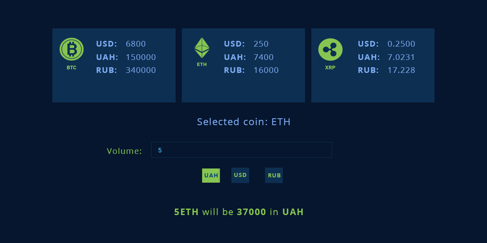

## Учебное задание #2

**Цель**: выяснить уровень знаний React/Redux/Redux Saga либо Redux Observable. Уровень работы с асинхронными запросами. Понимание взаимодействия клиента и сервера.

### Предподготовка

Необходимо сделать реализовать приложение на React/Redux. 

Для интерффейса используем одно из решений:
+ [React Bootstrap](https://react-bootstrap.github.io)
+ [ElementUI](https://github.com/ElemeFE/element-react)
+ [ReactStrap](https://reactstrap.github.io/)

### Требования
+ Использовать React
+ Использовать Redux + Redux Saga либо Redux Observable для асинхронных запросов к API.

### Внешний вид

+ виджеты карса криптовалюты
+ поле для ввода желаймой суммы обмена
+ селектор (радио баттон) для выбора желаймой денежной валюты
+ блок с информацией о том сколько введенная суммакриптовалюты стоит в выбранном денежной эквиваленте

### Получение курсов валют
В качевстве сервиса для полючение курсов валют можно выбрать любой, к примеру 
PrivatBank exchange: https://api.privatbank.ua/#p24/exchange

### Поведение
+ юзер видит курс валют для BTC, ETH, XRP
+ юзер видит инпут в котором он может ввести желаемую сумму обмена
+ юзер видит радио баттоны или кнопки, с помощью которых он может выбрать желаемую валюту в которую он хочет совершить обмен
+ при клике на блок криптовалюты, пользователь выбирает желаемую криптовалюту для обмена, по умолчанию BTC
+ при заполнении инпута юзер может вводить только денежный эквивалент
+ при заполнении инпута юзер сразу видит изминения в блоке под инпутом, сколько крипта будет стоить в денежном эквиваленте
+ юзер может менять желаюемую денежную валюту для обмена, по умолчанию UAH. 
+ по умолчанию мы разрешаем менять на UAH, USD, RUR

### Assets
Картинки криптовалют:
+ [BTC](assets/task2/icons/BTC.png)
+ [ETH](assets/task2/icons/ETH.png)
+ [XRP](assets/task2/icons/XRP.png)
