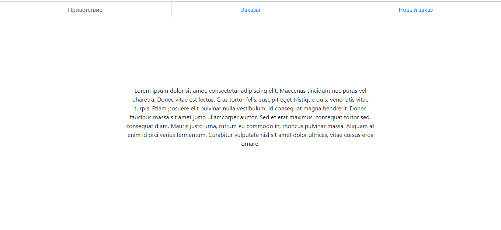
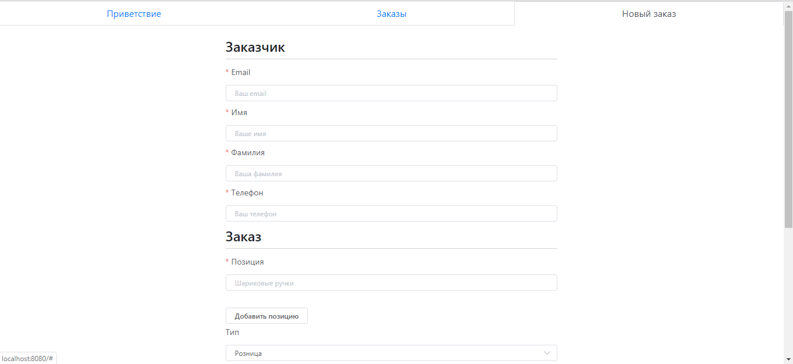
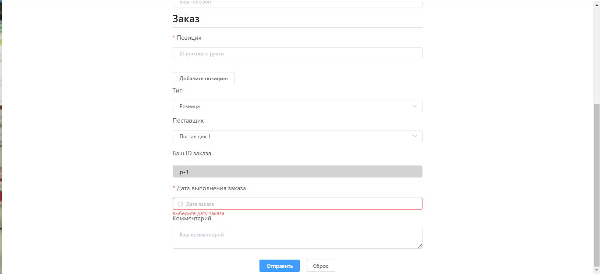
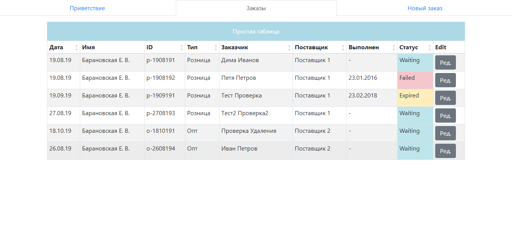

## Учебное задание #3

**Цель**: выяснить уровень знаний React/Redux. Уровень работы с асинхронными запросами. Понимание взаимодействия клиента и сервера.

### Предподготовка

Необходимо сделать реализовать приложение на React/Redux. 

Для интерффейса используем одно из решений:
+ [React Bootstrap](https://react-bootstrap.github.io)
+ [ElementUI](https://github.com/ElemeFE/element-react)
+ [ReactStrap](https://reactstrap.github.io/)

### Требования
+ Использовать React
+ В качестве сервера можно использовать ```json-server``` или ```Firebase```. Firebase предпочтительнее

### Функционал
+ Простейшая система аккаунтов
+ Страница приветствия
+ Форма создания заказа
+ Список заказов
+ Возможность изменять статус заказа

### Поведение
Пройдя аутентификцию, пользователь видит страницу приветствия и топ меню с айтемами:
+ Приветствие
+ Заказы
+ Новый заказ



Пользователь переходит на страницу создания заказа и видит форму заказа
* Все данный в форме должны валидировать на пустоту и валидность (email, телефон)




* При нажатии на кнопку Отправить , пользователь создает заказ со статусом New

Пользователь кликает на линк Заказы и видит страницу со списком заказов



* При клике на статус, пользователь видит попап со списком статусов [`New`, `Waiting`, `Expired`, `Failed`, `Finished`], при клике на статус мы меняем статус заказа
* При клике на кнопку редактирования, мы переходим на страницу редактирования, которая идентична странице создания заказа, за исключением того, что туда мы добавляем возможность изменить статус
* Таблица должна иметь возможность сортировки
* Таблица должна выводить данные по 50 записей, т.е. должна иметь постраничный вывод
